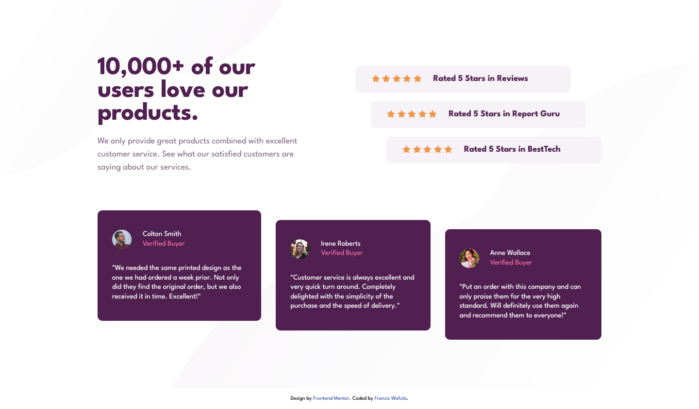
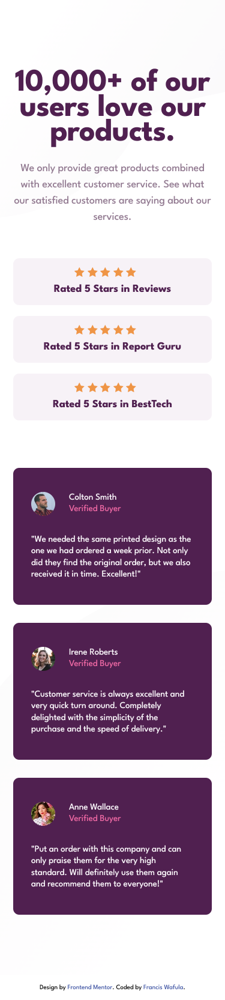

# Frontend Mentor - Social Proof Section Challenge 👋🏾



This the [Social Proof Section Challenge on Frontend Mentor](https://franco2ke.github.io/social-proof-website-section/). Thanks for checking it out

## Table of contents 🧳

- [Overview](#overview)
  - [The objective](#the-objective)
  - [Screenshot](#screenshot)
  - [Links](#links)
- [My process](#my-process)
  - [Built with](#built-with)
  - [What I learned](#what-i-learned)
  - [Useful resources](#useful-resources)
- [Author](#author)

## Overview

This is an entire Social Proof Website Section that is used in online shops to showcase products. The idea here is that people are more likely to take the desired action on a website, if they see others have done the same. It increases the likelihood that a shopper who is not sure about your product or service will make a decision.

### The objective

Users are be able to:

- View the optimal layout for the card depending on their device's screen size.

### Screenshots

#### Mobile View



### Links

- Solution URL: [https://github.com/franco2ke/social-proof-website-section](https://franco2ke.github.io/social-proof-website-section/)
- Live Site URL: [https://franco2ke.github.io/social-proof-website-section/](https://franco2ke.github.io/product-preview-card/)

## My process

I started by examining the design images and listing the key visible html elements required. Because it is a whole website section, the next step was to identify the individual components which I categorized as; a section headline, ratings section and a testimonial section. I drilled down further and broke each component into it's BEM elements.

From here I came up with the draft HTML structure for the section, starting with the section container and the components container. For the layout it was necessary to have two key containers. One for the entire section and where the background image is placed. The second is the centered section which contains all the components.

With this list of component elements, I proceeded to assign class names via the BEM methodology.

My development approach was to position the components via CSS Grid. Because the ratings and testimonial sections consisted of 3 identical items, flexbox was used to position the key elements. I found CSS Grid more practical for the overall layout and CSS position for positioning the elements within the components.

Effort was made to space elements using the 'gap' flex-box property, minimizing usage of margins where possible, with an aim of reducing work and also increasing the maintainability and resuability of the component.

### Built with

- Semantic HTML5 markup
- CSS custom properties
- CSS Grid
- Flexbox
- Desktop first workflow
- [SASS](https://sass-guidelin.es) - Sassy Sass
- [BEM](http://getbem.com/introduction/) - BEM methodology

### What I learned

Choosing appropriate classnames via BEM Methodology; BEM naming of classes is not the most elegant at times but when done properly makes revisiting and maintaining code much easier.

```html
<!-- Example BEM Naming -->
<div class="testimonial-item testimonial-item--three">
  <div class="testimonial-item__author">
    
    <div class="testimonial-item__author-text-box">
      <span class="testimonial-item__author-name">Anne Wallace</span>
      <span class="testimonial-item__author-detail">Verified Buyer</span>
    </div>
  </div>
  <p class="testimonial-item__review">Example BEM</p>
</div>
```

### Useful resources

- [Common Problems with BEM](https://www.smashingmagazine.com/2016/06/battling-bem-extended-edition-common-problems-and-how-to-avoid-them/) - On common BEM pitfalls and how to avoid them.
- [BEM by Example](https://sparkbox.com/foundry/bem_by_example) - Common BEM errors explained with examples.

## Author

- Website - [https://www.franciswafula.com](https://www.franciswafula.com)
- Frontend Mentor - [@franco2ke](https://www.frontendmentor.io/profile/franco2ke)
- Twitter - [@franco2ke](https://twitter.com/franco2ke)

Happy Coding 🎯
